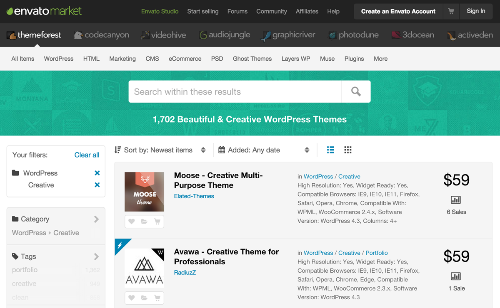
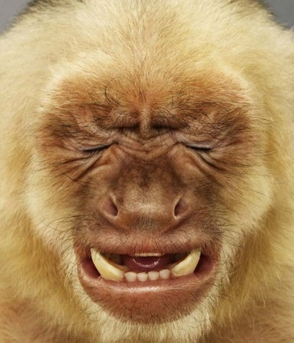
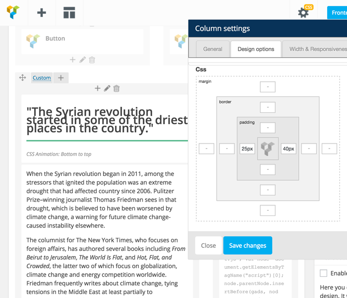
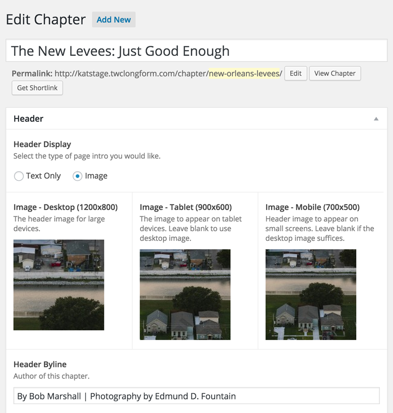
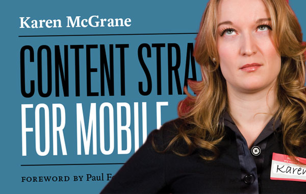
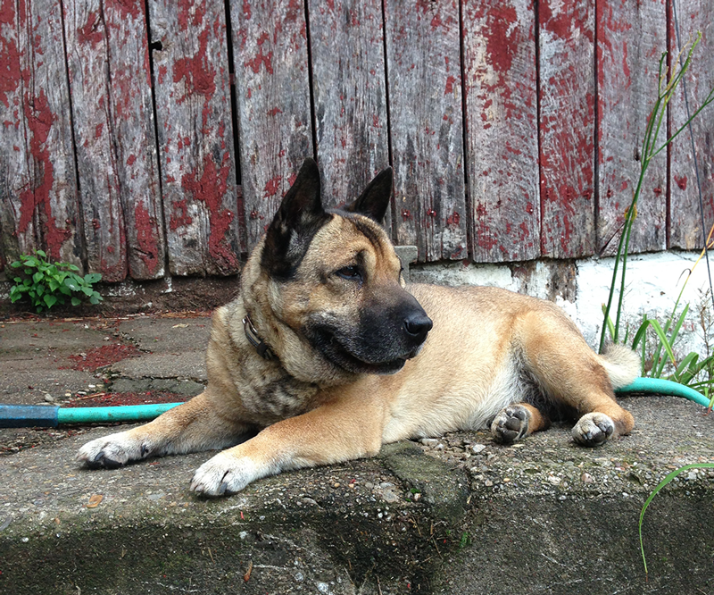
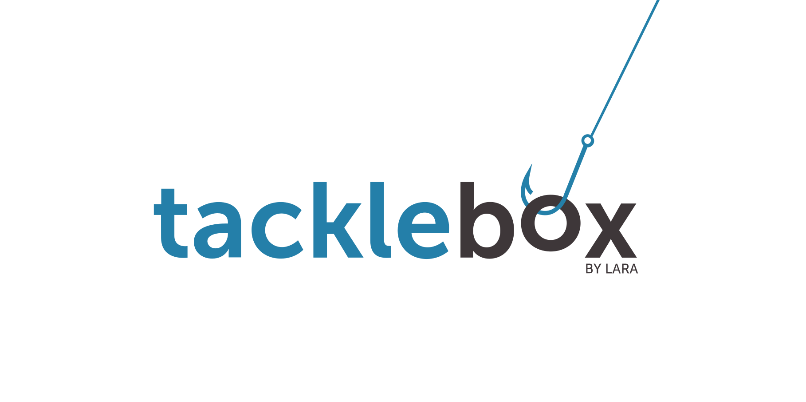

#Hey!
##I'm Lara (not Laura)

 
 
###[notlaura.com](http://notlaura.com) // @laras126

/--/

/--/

### Front-end/WordPress
# Designaveloper
### Consultant/Teacher/Person

/--/

<h2>Agenda</h2>
 

<h3 class="fragment" style="padding-left: 15%;">Chunk 1</h3>
 
<ul class="fragment" style="padding-left: 15%;">
	<li>WordPress?</li>
	<li>Themes...ugh.</li>
	<li>Set up Environments</li>
	<li>PHP (is gross)</li>
</ul>

	<h3 class="fragment">Chunk 2</h3>
	 
	<ul class="fragment">
		<li>Planning Content</li>
		<li>Mapping to WordPress</li>
		<li>Dev time</li>
		<li>Show-n-tell</li>
	</ul>

/--/

<h2>Things to Know</h2>
<ul>
	<li>Confusion is the goal</li>
	<li>Ask questions</li>
	<li>Answer questions</li>
	<li>http://tlk.io/gdiwp</li>
</ul>

/--/

<h2>Think of a website!</h2>
<h4 class="fragment">Not a "platform".</h4>

/---/

/--/

/--/

/--/

/--/

/--/

# Case Study
<h4 class="fragment">Theme vs. Website</h4>

/---/

<a href="http://climate25.com">

<a href="http://katrina.weather.com">

/--/

/---/

/--/

<pre class="language-clike text-center"><code class="big">&lt;?php echo 'gross'; ?&gt;</code></pre>

/--/

/--/

By Jared Nova &amp; Upstatement. <a href="http://timber.upstatement.com">Link.</a>

/--/

	
	
<a target="blank" href="http://tacklebox.notlaura.com/build-a-responsive-wordpress-website/">Build a Responsive WordPress Website</a>

/--/

#Thanks!

###[notlaura.com](http://notlaura.com) // @laras126
