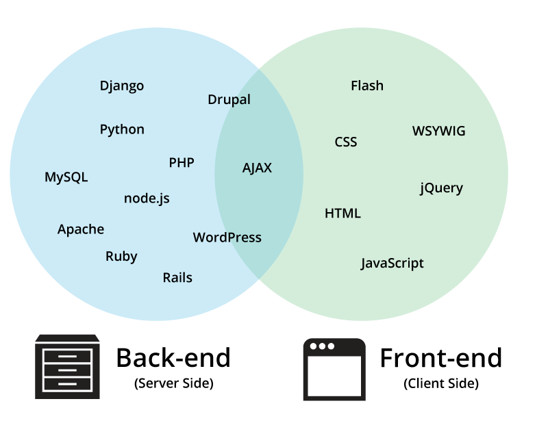

#

--

##I'm Lara. 
##Who are you?

--

##Ground Rules
*  Ask anything
*  Remember one thing
*  Confusion is the goal

--

##Agenda
*  So, the Internet...
*  Dissect a website
*  CMSs
*  Modern trends
*  On Web Designers

---

#So, the Internet...

--

<small>via <a href="http://www.vladstudio.com/wallpaper/?how_internet_works">VladStudio</a></small>

--

##Front-end vs. Back-end

--

--

<small>via <a href="https://www.liquidmatrix.org/blog/2011/08/03/internet-explorer-users-eat-paste/">Liquid Matrix</a></small>

--

##Questions?

---

#Dissect a website

	--
	##Questions?

---

#CMS
###Content Management Systems
	--
	

	###So many!

	--

	###Let's compare

	

	

	--
	###Use WordPress, IMHO
	*  Familiar
	*  Excellent documentation and support network
	*  Themes out the wazoo (but be careful)
	*  19% of all websites, 50% of CMSs
	
	--
	
	
	###??

---

#Modern Trends
	--
	>42 percent of smartphone owners between the ages of 18 and 29 consider their phone as their primary way of accessing the internet.
	
	Source:

	http://alistapart.com/article/client-relationships-and-the-multi-device-web
	
	http://pewinternet.org/Reports/2011/Smartphones/Section-2.aspx
	--
	
	###Responsive Design
	Example: http://techcrunch.com/
	(Resize your browser!)
	
	--
	

	--
	#Content
	##is king/queen

	err.. leader?
	
	--
	##Questions?

---
#On Web Designers

