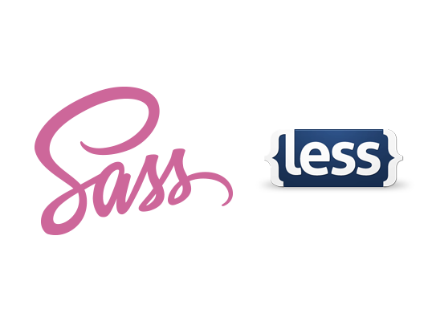
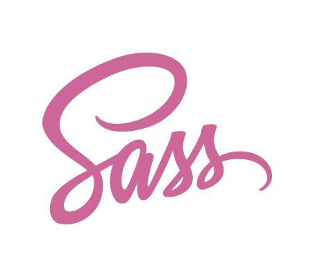

#Sassy WordPress

--

But it's hardcore and so hard...
(picture of grunt, complicated mixin)

--

No way!

It can be this simple:
variable example
---

#Preprocessors 101

--

<h3 class="snippet-title">SCSS</h3>

	$font-stack:    Helvetica, sans-serif;
	$primary-color: #333;

	body {
	  font: 100% $font-stack;
	  color: $primary-color;
	}

<h3 class="snippet-title">CSS</h3>

	body {
		font: 100% Helvetica, sans-serif;
		color: #333;
	}

--

	

<aside class="notes">
	<ul>
		<li>[Sass](http://sass-lang.com)</li>
		<li>[Less](http://lesscss.org)</li>
		<li>[Stylus](http://learnboost.github.io/stylus/)</li>
		<li>[Sass vs. Less](http://css-tricks.com/sass-vs-less/)</li>
	</ul>
</aside>

--

# #teamSass

<aside class="notes">
	[Sass Community](http://sass-lang.com/community)
</aside>

---

#Some Clarifications

--

#Sass vs SASS

--

<h1 class="text-left">
	Syntactically  
	Awesome  
	Style  
	Sheets
</h1>

--

---

#<pre class="heading">.sass</pre> vs <pre class="heading">.scss</pre>

<aside class="notes">
	[Sass vs SCSS - which syntax is better?](http://thesassway.com/editorial/sass-vs-scss-which-syntax-is-better)
</aside>

--

<h3 class="code-title">Sass</h3>

<pre class="language-scss">
	<code>
	$grey: #333
	$light-grey: #999

	.block
		background-color: $grey
		.sub-block
			background-color: $light-grey
	</code>
</pre>

<h3 class="code-title">SCSS</h3>

<pre class="language-scss">
	<code>
	$grey: #333
	$light-grey: #999

	.block {
		background-color: $grey;
		.sub-block {
			background-color: $light-grey;
		}
	}
	</code>
</pre>

--

#<pre class="heading text-center">.scss</pre>

---

#Where to start?

--
#1
##Install
##http://sass-lang.com/install

---

#2
##Change where your stylesheet is

--

<pre>functions.php</pre>

	function my_styles() {
		wp_enqueue_style('my_styles', get_template_directory_uri() . '/assets/css/main.min.css', false);
	}
	add_action('wp_enqueue_scripts', 'my_styles', 100);

---

#3
##Make a lot of files

<aside class="notes">
	[Structuring a Project](http://thesassway.com/beginner/how-to-structure-a-sass-project)
</aside>

--

###Like this:

	scss/
		modules/              # Common modules
			_all.scss         # Include to get all modules
			_utility.scss     # Module name
			_mixins.scss 	  # Mixins
			_settings.scss 	  # Variables

		partials/             # Partials
			_all.scss         # imports for all mixins + global project variables
			_buttons.scss     # buttons
			_figures.scss     # figures
			_grids.scss       # grids
			_typography.scss  # typography
			_reset.scss       # reset
	
		vendor/               # CSS or Sass from other projects
			_fancybox.scss
			_jquery.ui.core.scss
	
		main.scss            # primary Sass file

--

#Overkill?
##
Maybe, but not really.

--
###Import 'em
<pre>main.scss</pre>

	// Modules and Variables
	@import "partials/base";

	// Partials
	@import "partials/reset";
	@import "partials/typography";
	@import "partials/buttons";
	@import "partials/figures";
	@import "partials/grids";
	// ...

	// Third-party
	@import "vendor/colorpicker";
	@import "vendor/jquery.ui.core";
	@import('settings');
	@import('typography');

---

#4
##Code!
###(But not in main.scss)

--

#Variables
###(My favorite)

--

	$base: 1.6rem;
	$sml: $base*0.8;
	
	$h1: $base*3;
	$h2: $base*2.2;
	$h3: $base*1.4;
	$h4: $base*1.2;
	$h5: $base;
	$h6: $sml;

--

	// nl colors

	$dark-blue:      	#237fa9;
	$offwhite:     		#f4f7f9;

	$dark-accent: 		$dark-blue;

	$link-color:		$dark-accent;
	$link-hover: 		$med-accent;

--

	$screen-sm:			481px;
	$screen-md: 		768px;
	$screen-lg: 		1040px;

---

#Media Query Bubbles
###(My second favorite)

--

###Encourages breakpoints via design rather than device

	$screen-sm: 320px;

	.profile-pic {
		@media only screen and (max-width: $screen-sm) {
			width: 100px;
			float: none;
	  }
	}

--

#Functions
(not my favorite but cool)
	lighten()
	darken()
	saturate()
	etc, etc.

--

#Extends
(I don't use them that much)

--

#Mixins
(Starting to get a little complicated)

---

	@mixin centerer {
		position: absolute;
		top: 50%;
		left: 50%;
		transform: translate(-50%, -50%);
	}

--

	.nice-picture {
		@include centerer;
	}

---

#Extends

	%centerer {
		position: absolute;
		top: 50%;
		left: 50%;
		transform: translate(-50%, -50%);
	}

--

	.nice-picture {
		@extend %centerer;
	}
--

#Compass

	@include transition(0.2 all ease-in);

--

#Bourbon

