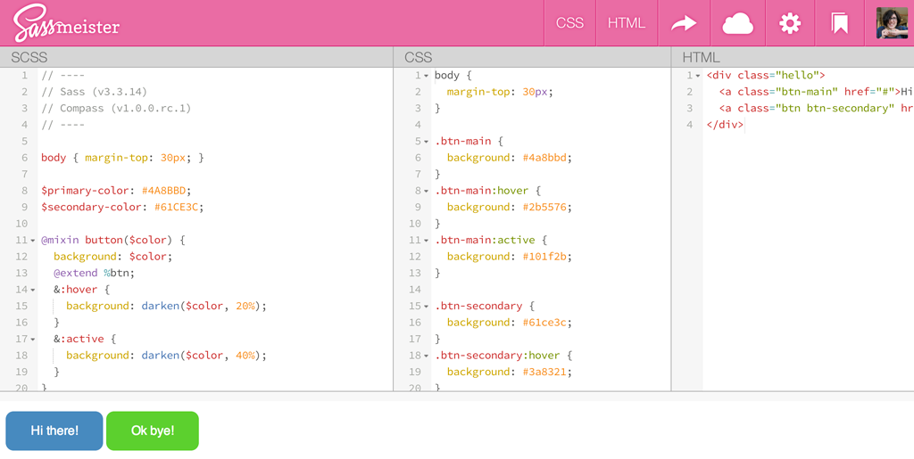

#Sassy WordPress

--

	<pre>
		<code class="lang-scss">
		@mixin gs-media($prefix, $type: false){
			@if $prefix == d {
				@if ($type == min) or ($type == min-max) { 
					@media only screen and (min-width: 990px) { @content; } 
				} @else { @content; }
			}
			@else if $prefix == t {
				@if ($type == min) or ($type == min-max) { 
					@media only screen and (min-width: 768px) { @content; } 
				} @else { @content; }
			}
		}
		</code>
	</pre>
	
Mixin from <a href="http://gridsetapp.com" target="blank">Gridset</a>

--

		

	<h1 class="center-vert">Yeah, same.</h1>

---

	
		<h3>Code (Sublime)</h3>
		<ul>
			<li>Preprocessors: Sass, Less, Stylus</li>
			<li>Bootstrap, Foundation, Bourbon, Compass</li>
			<li>Coffeescript, HAML, Jade</li>
		</ul>
	

	
		<h3>Tasks (CLI)</h3>
		<ul>
			<li>Jekyll</li>
			<li>Yoeman</li>
			<li>Grunt, Gulp</li>
		</ul>
	

	
		<h3>Deploy (your server)</h3>
		<ul>
			<li>Version control (Github, SVN)</li>
			<li>Beanstalk, d.ploy</li>
			<li>Heroku</li>
		</ul>
	

---

<h1>Preprocessors</h1>

--

<video controls autoplay loop src="../img/sass/compiler.mov"></video>

--

--

	

<aside class="notes">
	<ul>
		<li>[Sass](http://sass-lang.com)</li>
		<li>[Less](http://lesscss.org)</li>
		<li>[Stylus](http://learnboost.github.io/stylus/)</li>
		<li>[Sass vs. Less](http://css-tricks.com/sass-vs-less/)</li>
	</ul>
</aside>

--

	

<aside class="notes">
	[Sass Community](http://sass-lang.com/community)
</aside>

---

#Sass vs SASS

--

	<h1 class="text-left">
		Syntactically  
		Awesome  
		Style  
		Sheets
	</h1>

--

---

#<pre class="heading">.sass</pre> vs <pre class="heading">.scss</pre>

<aside class="notes">
	[Sass vs SCSS - which syntax is better?](http://thesassway.com/editorial/sass-vs-scss-which-syntax-is-better)
</aside>

--

style.sass

<pre class="language-sass">
<code>$gray: #a4a4a4
$blue: #237FA9

.block
	color: $gray

	.sub-block
		color: $blue

</code>
</pre>

style.scss

<pre ><code>$gray: #a4a4a4;
$blue: #237FA9;

.block {
	color: $gray;

	.sub-block{
		color: $blue;
	}
}
</code>
</pre>

--

#<pre class="heading text-center">.scss</pre>

---

#Where to start?

--
#1
##Install
##http://sass-lang.com/install

---

#2
##Change where your stylesheet is

--

<pre>functions.php</pre>

	function my_styles() {
		wp_enqueue_style('my_styles', get_template_directory_uri() . '/assets/css/main.min.css', false);
	}
	add_action('wp_enqueue_scripts', 'my_styles', 100);

---

#3
##Make a lot of files

<aside class="notes">
	[Structuring a Project](http://thesassway.com/beginner/how-to-structure-a-sass-project)
</aside>

--

###Like this:

	scss/
		modules/              # Common modules
			_all.scss         # Include to get all modules
			_utility.scss     # Module name
			_mixins.scss 	  # Mixins
			_settings.scss 	  # Variables

		partials/             # Partials
			_all.scss         # imports for all mixins + global project variables
			_buttons.scss     # buttons
			_figures.scss     # figures
			_grids.scss       # grids
			_typography.scss  # typography
			_reset.scss       # reset
	
		vendor/               # CSS or Sass from other projects
			_fancybox.scss
			_jquery.ui.core.scss
	
		main.scss            # primary Sass file

--

#Overkill?
##
Maybe, but not really.

--
###Import 'em
<pre>main.scss</pre>

	// Modules and Variables
	@import "partials/base";

	// Partials
	@import "partials/reset";
	@import "partials/typography";
	@import "partials/buttons";
	@import "partials/figures";
	@import "partials/grids";
	// ...

	// Third-party
	@import "vendor/colorpicker";
	@import "vendor/jquery.ui.core";
	@import('settings');
	@import('typography');

---

#4
##Code!
###(But not in main.scss)

--

#Variables
###(My favorite)

--

	$base: 1.6rem;
	$sml: $base*0.8;
	
	$h1: $base*3;
	$h2: $base*2.2;
	$h3: $base*1.4;
	$h4: $base*1.2;
	$h5: $base;
	$h6: $sml;

--

	// nl colors

	$dark-blue:      	#237fa9;
	$offwhite:     		#f4f7f9;

	$dark-accent: 		$dark-blue;

	$link-color:		$dark-accent;
	$link-hover: 		$med-accent;

--

	$screen-sm:			481px;
	$screen-md: 		768px;
	$screen-lg: 		1040px;

---

#Media Query Bubbles
###(My second favorite)

--

###Encourages breakpoints via design rather than device

	$screen-sm: 320px;

	.profile-pic {
		@media only screen and (max-width: $screen-sm) {
			width: 100px;
			float: none;
	  }
	}

--

#Functions
(not my favorite but cool)
	lighten()
	darken()
	saturate()
	etc, etc.

--

#Extends
(I don't use them that much)

--

#Mixins
(Starting to get a little complicated)

---

	@mixin centerer {
		position: absolute;
		top: 50%;
		left: 50%;
		transform: translate(-50%, -50%);
	}

--

	.nice-picture {
		@include centerer;
	}

---

#Extends

	%centerer {
		position: absolute;
		top: 50%;
		left: 50%;
		transform: translate(-50%, -50%);
	}

--

	.nice-picture {
		@extend %centerer;
	}
--

#Compass

	@include transition(0.2 all ease-in);

--

#Bourbon

