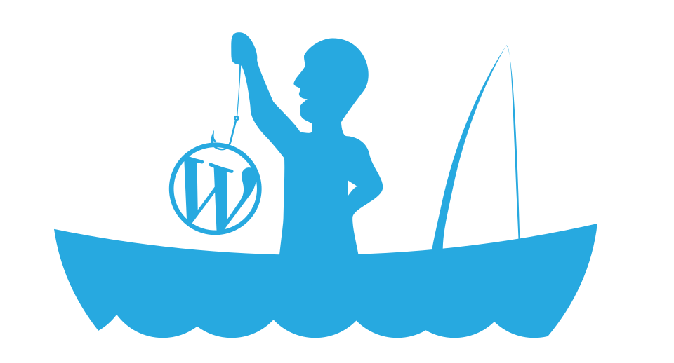

--

<blockquote class="callout-quote">Give a man (or woman) a fish and feed him (or her) for a day, teach a man (or woman) to fish and feed him (or her) for a lifetime.</blockquote>

--

---

Source: <a href="http://reddit.com/r/gifs">r/gifs</a>

--

Source: <a href="lmgtfy.com">lmgtfy.com</a>

--

Source: <a href="http://www.vladstudio.com/wallpaper/?how_internet_works">VladStudio</a>

---

#&#8984; + &#8997; + 2

--

--

--

#<a href="http://notlaura.com">notlaura.com</a>
