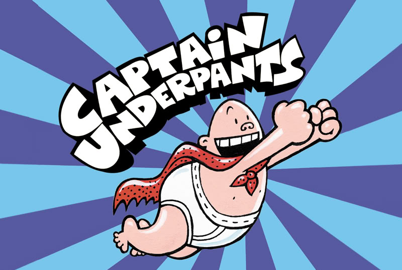
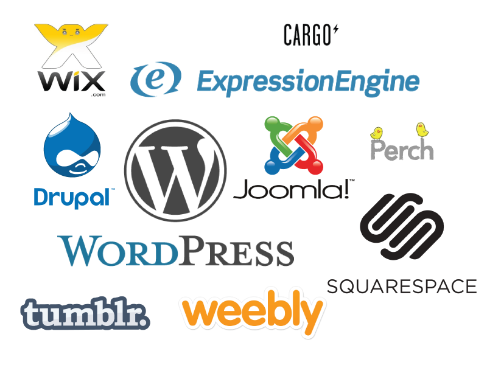
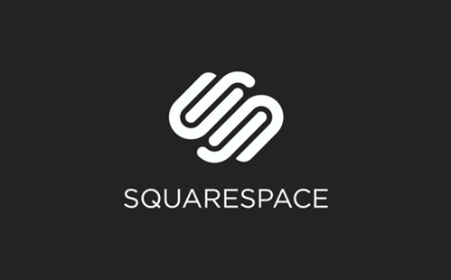
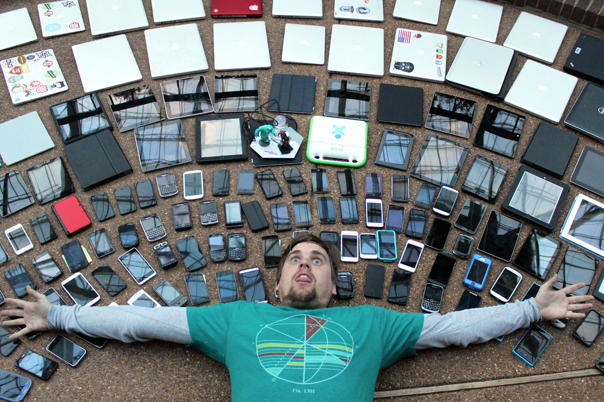
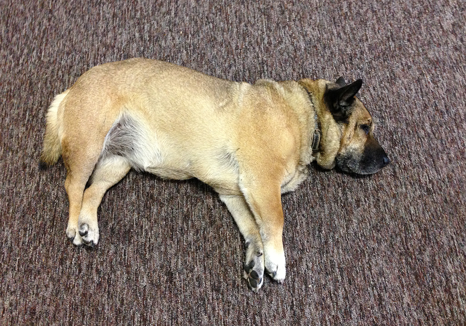

# Hey!
## I'm Lara (not Laura)

 
 

### [notlaura.com](http://notlaura.com) // @laras126

/--/

/--/

/--/

/---/

# So, websites...

/--/

/--/

### Let's talk about...

 

*  WTF Internet
*  Website Underpants
*  WordPress and Whatnot
*  Phablets and Trends
*  What now?

/---/

# WTF Internet

/--/

/--/

/--/

/--/

/--/

/--/

<small>via <a href="https://www.liquidmatrix.org/blog/2011/08/03/internet-explorer-users-eat-paste/">Liquid Matrix</a></small>

/---/

# Website Underpants

/--/

/--/

	<h1>OMG CODE</h1>
	
I don't even know.

 
(Lara: Make an ugly webpage in 30ish seconds)</small>

/--/

### Inspect!

 

*  http://oak.is/
*  https://usepanda.com/app/
*  http://instacart.com

/---/

# WordPress and Whatnot

/--/

## CMS
###Content Management System

/--/

/--/

### RAWR!
 

/--/

### Lara's opinionated recommendations:

 

*  Photographer? Squarespace.
*  Restaurant? Squarespace.
*  Graphic Designer? Squarespace.
*  Small business? WordPress.
*  Blog? WordPress.
*  Have money? WordPress.
*  Have a specific idea? WordPress (and money).
*  A "app" or "platform" for something? NEITHER.

/--/

In sum:

## Will you want to add new features?
 
<h3 class="fragment">Yes: WordPress</h3>
<h3 class="fragment">No: Squarespace</h3>

/--/

/---/

# Phablets and Trends

/--/

<small>The illustrious <a href="http://bradfrost.com">Brad Frost</a></small>

/--/

>Mobile digital media time in the US is now significantly higher at 51% compared to desktop (42%).

<small>[Smart Insights](http://www.smartinsights.com/mobile-marketing/mobile-marketing-analytics/mobile-marketing-statistics/), July 2015</small>

/--/

>After 1 second, users get impatient and notice that they're waiting for a slow computer to respond. The longer the wait, the more this impatience grows; after about 10 seconds, the average attention span is maxed out.

<small>Source: [Nielsen Norman Group](http://www.nngroup.com/articles/powers-of-10-time-scales-in-ux/)</small>

/--/

### The five most important things for a website:
 

1. Content
2. Content</a>
3. Speed
4. Content
5. Speed

 

(Lara: go to the links!)

/--/

/---/

# What now?

/--/

<h3 class="fragment">How much does a website cost?</h3>

<h3 class="fragment">How much does a dinner cost?</h3>

<h3 class="fragment">How much does a car cost?</h3>

<h3 class="fragment">How much does a wedding cost?</h3>

/--/

<small>A $200,000 website.</small>

/--/

 
<small>A $50,000 website.</small>

/--/

<small>A $4,000 website.</small>

/--/

 
<small>A $500 website.</small>

/--/

 
<small>DIY. About $150/year + $50 theme + time.</small>

/--/

### http://thenuschool.com/how-much

/--/

