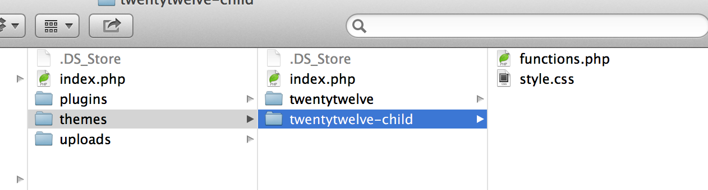
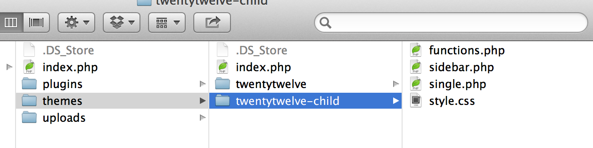
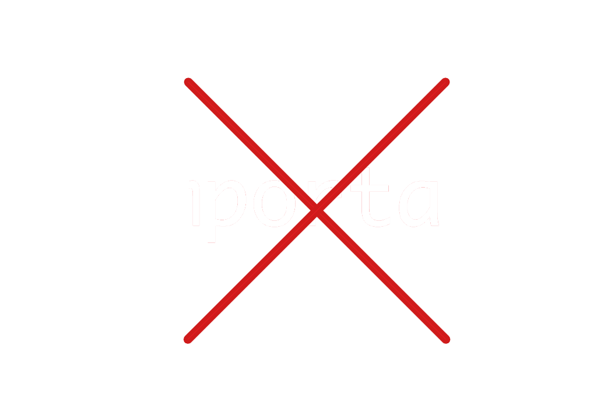
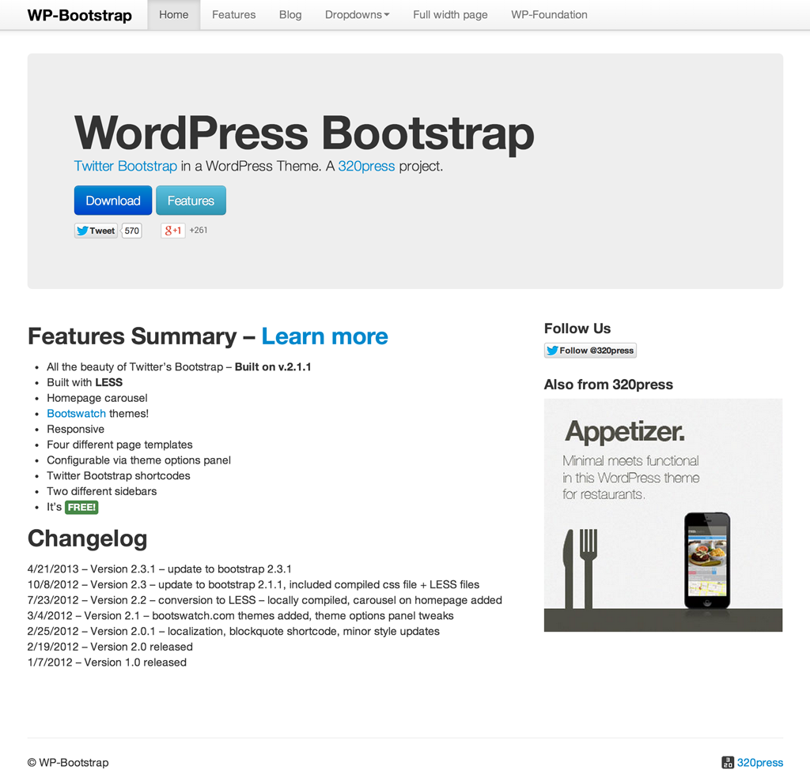
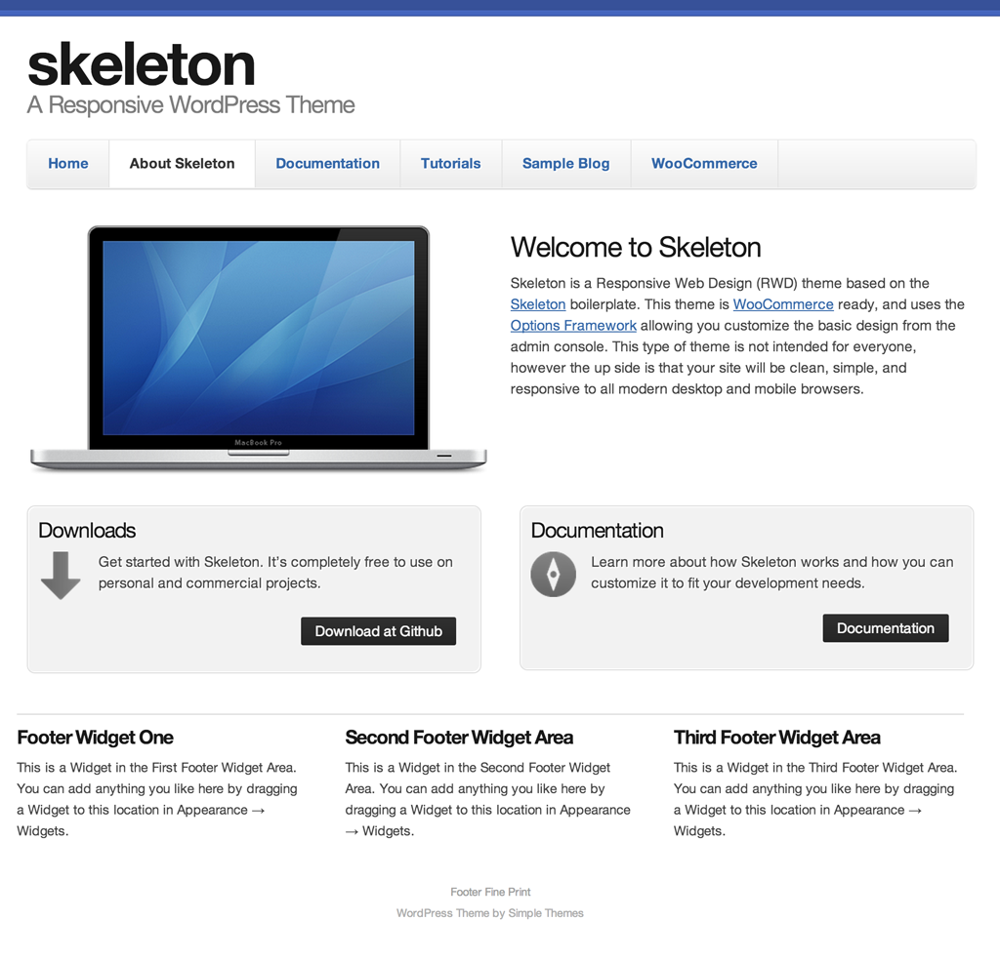

#Child Themes 
##A Crash Course

--

##Hey!
#I'm Lara

--

(that's not me)

--

##Before we begin...
(expectations/disclaimers)

--

###Part 1
#Child...what?
Good question.

---

<blockquote>
	... a theme that inherits the functionality of another theme, called the parent theme.
</blockquote>
 
&hearts; The Codex

---

Like this:

---

Then this:

--

###Part 2
#Pros/Cons

---

##Pros:
*  Easy theme updating
*  Fallback if you mess up
*  Customize existing themes

---

##Cons:
*  Easy to bloat
*  Frustrating for devs
*  Grandchild themes?!

---

#Now...
###the Ultimate Con:

---

--

###Part 3
#Use Cases

---

###Uno
#The Student

---

###Dos
#The Broke Client

---

###Tres
#Fast Development
(maybe)

--

###Frameworks

--

###Starter-esque themes

---

###Part 4
#Pop Quiz!
Child theme or no?

--

Case 1

### Add a text shadow to your site title.

--

Case 2

### Make a site responsive.

--
Case 3

### Add templates for a custom post type.

---

###Part 5
#Demo Time!
But first, a word on [Theme Sense](http://themeshaper.com/2012/10/23/developing-your-theme-sense-tutorial-2/)/how I work

---

##Resources
*  [Modify WP Themes the Smart Way](http://themeshaper.com/modify-wordpress-themes/)
*  [Theme Sense](http://themeshaper.com/2012/10/23/developing-your-theme-sense-tutorial-2/)
*  [WP Bootstrap](http://320press.com/wpbs/)
*  [Skeleton](http://themes.simplethemes.com/skeleton/)
*  [Genesis Framework](http://www.studiopress.com/features)
*  [These Slides](http://stuff.notlaura.com/slides/wpnyc.html)

